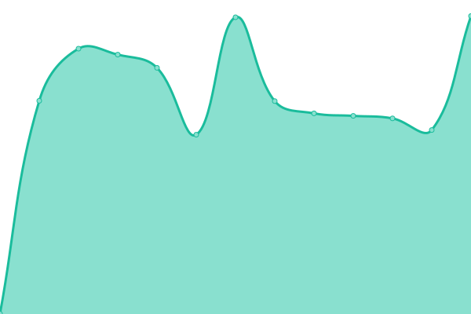
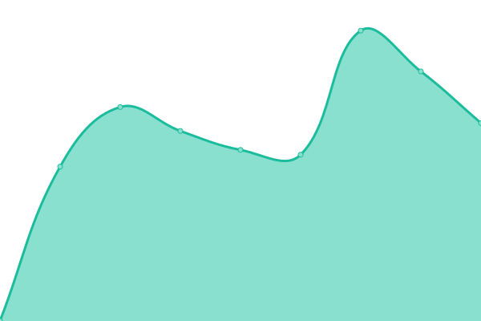

# [📈 Live Status](https://upptime.github.io/upptime): <!--live status--> **🟧 Partial outage**

This repository contains the open-source uptime monitor and status page for [Upptime](https://upptime.js.org), powered by [Upptime](https://github.com/upptime/upptime).

With [Upptime](https://upptime.js.org), you can get your own unlimited and free uptime monitor and status page, powered entirely by a GitHub repository. We use [Issues](https://github.com/upptime/upptime/issues) as incident reports, [Actions](https://github.com/mt190502/uptime.mtaha.dev/actions) as uptime monitors, and [Pages](https://upptime.github.io/upptime) for the status page.

<!--start: status pages-->
<!-- This summary is generated by Upptime (https://github.com/upptime/upptime) -->
<!-- Do not edit this manually, your changes will be overwritten -->
<!-- prettier-ignore -->
| URL | Status | History | Response Time | Uptime |
| --- | ------ | ------- | ------------- | ------ |
|  [Anki Sync Server](https://anki.mtaha.dev) | 🟥 Down | [anki-sync-server.yml](https://github.com/mt190502/uptime.mtaha.dev/commits/HEAD/history/anki-sync-server.yml) | 

 762ms
     
 | 

<a href="https://uptime.mtaha.dev/history/anki-sync-server">0.17%</a>
    

|  [Miniflux](https://rss.mtaha.dev) | 🟩 Up | [miniflux.yml](https://github.com/mt190502/uptime.mtaha.dev/commits/HEAD/history/miniflux.yml) | 

 973ms
     
 | 

<a href="https://uptime.mtaha.dev/history/miniflux">100.00%</a>
    

|  [Nightscout](https://t1d.mtaha.dev) | 🟩 Up | [nightscout.yml](https://github.com/mt190502/uptime.mtaha.dev/commits/HEAD/history/nightscout.yml) | 

 883ms
     
 | 

<a href="https://uptime.mtaha.dev/history/nightscout">100.00%</a>
    

|  [Radicale](https://dav.mtaha.dev) | 🟩 Up | [radicale.yml](https://github.com/mt190502/uptime.mtaha.dev/commits/HEAD/history/radicale.yml) | 

 1116ms
     
 | 

<a href="https://uptime.mtaha.dev/history/radicale">100.00%</a>
    

|  [Redmine](https://red.mtaha.dev) | 🟩 Up | [redmine.yml](https://github.com/mt190502/uptime.mtaha.dev/commits/HEAD/history/redmine.yml) | 

 1081ms
     
 | 

<a href="https://uptime.mtaha.dev/history/redmine">100.00%</a>
    

|  [Umami](https://umami.mtaha.dev) | 🟩 Up | [umami.yml](https://github.com/mt190502/uptime.mtaha.dev/commits/HEAD/history/umami.yml) | 

 704ms
     
 | 

<a href="https://uptime.mtaha.dev/history/umami">100.00%</a>
    

<!--end: status pages-->

[**Visit our status website →**](https://upptime.github.io/upptime)

## 📄 License

- Powered by: [Upptime](https://github.com/upptime/upptime)
- Code: [MIT](./LICENSE) © [Anand Chowdhary](https://anandchowdhary.com), supported by [Pabio](https://pabio.com)
- Data in the `./history` directory: [Open Database License](https://opendatacommons.org/licenses/odbl/1-0/)
